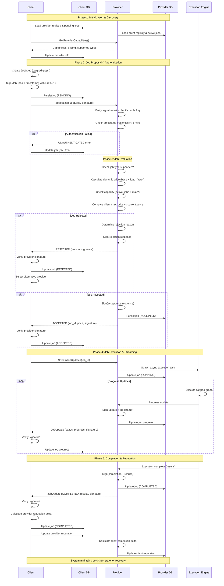

# gRPC Compute Service Design Plan

## 1. Overview

The system enables clients to offload AI workload computation (represented as catgrad graphs) to distributed providers through an authenticated gRPC interface. The core interaction pattern is request-based: clients propose jobs, providers evaluate them based on current capacity and pricing, and either accept or reject them. All communications are authenticated using Ed25519 signatures to ensure both parties can trust each other's identity.

**Core Design Philosophy:**
- Mutual trust through cryptographic authentication
- Stateful actors that maintain knowledge of peers and job history
- Asynchronous job execution with real-time status updates
- Economic incentives through dynamic pricing based on provider load



## 2. State Management Architecture

### Client State Model

The client maintains a view of the compute marketplace. It tracks:
- **Provider Registry**: All known compute providers with their capabilities, current pricing, and historical reliability scores
- **Job Portfolio**: Active jobs mapped to providers, including pending proposals, running executions, and completed work
- **Authentication Credentials**: Its own Ed25519 keypair and the public keys of all trusted providers

The client's decision-making revolves around selecting the optimal provider for a given job based on price, availability, and reputation.

### Provider State Model

The provider maintains operational state to make real-time acceptance decisions:
- **Client Registry**: Known clients with their public keys and reputation metrics
- **Capacity Metrics**: Current load (active jobs, CPU/memory usage, queue depth)
- **Pricing Configuration**: Base rates, accepted job types, and dynamic pricing rules
- **Job Execution State**: Currently running jobs with progress tracking

The provider's core responsibility is evaluating whether accepting a new job makes economic and operational sense given current conditions.

### Persistence Strategy

Both actors persist state to PostgreSQL (or SQLite/RocksDB/LMDB/ReDB, or any other suitable database). This ensures:
- **Recovery**: After restarts, actors restore their view of peers and pending jobs
- **Audit Trail**: Complete history of jobs, pricing decisions, and peer interactions
- **Analytics**: Historical data enables reputation scoring and pricing optimization

State updates occur transactionally. Each significant event (job proposal, status change, completion) triggers a database write to maintain consistency.

## 3. gRPC Service Flow Architecture

### Service Interface Design

The gRPC service defines five core operations:

**ProposeJob**: Client initiates job submission
**GetJobStatus**: Polling-based status check (fallback mechanism)
**StreamJobUpdates**: Server-streaming for real-time progress updates
**CancelJob**: Client-initiated job termination
**GetProviderCapabilities**: Discovery mechanism for provider features and pricing

This design separates synchronous decision-making (proposal/response) from asynchronous execution (streaming updates).

### Authentication Flow

Every gRPC call follows a uniform authentication pattern:

1. **Message Construction**: The caller assembles the request payload and adds a timestamp
2. **Signature Generation**: The caller signs the concatenation of (payload + timestamp) using their Ed25519 private key
3. **Transmission**: The signed message is sent with the signature and caller's public key identifier
4. **Verification**: The receiver looks up the caller's public key, verifies the signature, and checks timestamp freshness (within 5-minute window to prevent replay attacks)
5. **Response Signing**: If verification succeeds, the receiver processes the request and signs their response similarly

This mutual authentication ensures that both parties can verify each other's identity at every interaction without needing a central authority.

## 4. Job Lifecycle Flow

### Phase 1: Job Proposal and Evaluation

**Client Side:**
1. Client creates a JobSpec containing the catgrad graph, resource requirements, and maximum acceptable price
2. Client selects a target provider from its registry based on pricing and capabilities
3. Client signs the proposal and sends it via the `ProposeJob` RPC
4. Client persists the job in local database with PENDING status
5. Client waits for provider's decision (with timeout)

**Provider Side:**
1. Provider receives the proposal and verifies the client's signature
2. Provider checks if client is in the known registry; if not, decides whether to accept new clients
3. Provider executes acceptance logic:
   - **Job Type Check**: Does the provider support this type of computation?
   - **Pricing Check**: Is the client's max price >= provider's current dynamic price?
   - **Capacity Check**: Does the provider have available resources (under max concurrent jobs)?
   - **Load-Based Pricing**: Current `price = base_price × (1 + load_factor)`
4. Provider generates a response indicating ACCEPTED or REJECTED (with reason)
5. Provider signs the response and returns it
6. If accepted, provider persists the job in its active jobs table

### Phase 2: Job Execution and Monitoring

**Provider Side:**
1. Provider spawns an asynchronous execution task for the catgrad graph
2. Provider creates a streaming channel for job updates
3. As execution progresses, provider emits JobUpdate messages containing:
   - Current status (RUNNING, progress percentage)
   - Partial results if applicable
   - Timestamp and signature
4. Provider monitors resource usage and updates its load metrics
5. On completion/failure, provider emits final update and marks job as complete in database

**Client Side:**
1. On receiving ACCEPTED response, client subscribes to `StreamJobUpdates` RPC
2. Client receives real-time updates through the gRPC stream
3. Client updates job status in local database with each update
4. Client verifies signatures on each update to ensure integrity
5. On completion, client stores final results and updates provider reputation

### Phase 3: Completion and Reputation Update

Both actors update their internal reputation systems:
- **Clients** adjust provider reputation based on successful completion, execution time vs estimate, and result quality
- **Providers** adjust client reputation based on payment behavior and job volume

These reputation scores influence future interactions—providers may offer better pricing to reliable clients, and clients prioritize reliable providers.

## 5. Dynamic Pricing Mechanism

The provider implements load-based dynamic pricing to optimize resource utilization:

**Pricing Formula:**
```
current_price = base_price × (1 + load_multiplier × current_load_factor)
```

Where `current_load_factor` is calculated from:
- Active job count vs max concurrent jobs
- CPU and memory utilization
- Queue depth

**Decision Logic:**
- **Low Load** (< 40% capacity): Price at or near base_price to attract jobs
- **Medium Load** (40-75% capacity): Moderate price increase
- **High Load** (> 75% capacity): Significant price increase to throttle new jobs

This creates a natural economic equilibrium where providers are incentivized to maintain optimal utilization, and clients can choose between cost and availability.

## 6. Error Handling and Recovery

### Connection Failures

**Client Side:**
- If `ProposeJob` fails, client retries with exponential backoff
- Client maintains a fallback list of providers and can redirect jobs
- Persistent pending jobs are retried on client restart

**Provider Side:**
- If a streaming update fails to send, provider logs the error but continues execution
- Provider maintains update history so clients can catch up via `GetJobStatus` polling

### Authentication Failures

- Invalid signatures result in immediate rejection with UNAUTHENTICATED status
- Repeated authentication failures trigger rate limiting and potential peer removal
- Both actors maintain a blocklist for malicious peers

### Resource Exhaustion

- Providers reject jobs when at capacity rather than queueing indefinitely
- Clients implement timeout logic: if no response within configured window, mark provider as unavailable
- Database connection pooling prevents state persistence from becoming a bottleneck

## 7. Concurrency and Parallelism

### Client Concurrency

Clients can submit multiple jobs to multiple providers simultaneously. Each job submission is an independent gRPC call with its own connection. The client uses async I/O (tokio runtime) to handle multiple concurrent submissions and streaming update subscriptions without blocking.

### Provider Concurrency

Providers handle multiple concurrent jobs using:
- **Thread Pool**: Dedicated worker threads for CPU/GPU-intensive catgrad execution
- **Async Runtime**: Non-blocking handling of gRPC connections and streaming updates
- **Connection Pooling**: Database connections are pooled to handle concurrent state updates
- **Lock-Free Metrics**: Current load metrics use atomic operations to avoid contention

The provider's `max_concurrent_jobs` setting caps parallelism to prevent resource exhaustion.

## 8. Discovery and Network Topology

### Initial Bootstrap

Clients and providers discover each other through:
- **Static Configuration**: Hardcoded list of initial providers
- **Out-of-Band Exchange**: Public key exchange through trusted channels
- **Gossip Protocol** (future extension): Peers share knowledge of other peers

### Ongoing Discovery

Clients use `GetProviderCapabilities` to:
- Query supported job types
- Fetch current pricing
- Check provider availability
- Learn about new capabilities

This allows dynamic adaptation as providers update their offerings.

## 9. Security Model

### Threat Model

The system protects against:
- **Impersonation**: Signatures prevent attackers from pretending to be legitimate peers
- **Replay Attacks**: Timestamps ensure old messages can't be reused
- **Man-in-the-Middle**: TLS encryption for gRPC channels (standard practice)
- **Denial of Service**: Rate limiting per client and job spec size validation

### Trust Assumptions

- Private keys remain secret and are securely stored
- Public key exchange happens through a trusted channel initially
- Database access is restricted to the local actor only
- Network layer provides TLS encryption (gRPC over HTTPS)

## 10. Data Structures Summary

**Essential Types:**
- **PeerId**: Identity (string ID + Ed25519 public key)
- **CatgradGraph**: Job representation (nodes, edges, entry point)
- **JobSpec**: Complete job definition (graph + resources + pricing)
- **JobTracking** (client): Job state + provider mapping + timestamps
- **ActiveJob** (provider): Job state + execution progress + client mapping

**Database Schema:**
- **Providers/Clients Tables**: Peer registry with public keys and reputation
- **Jobs Tables**: Job history with specs, status, and timestamps
- **Indices**: On job_id, status, and timestamps for efficient queries

## 11. Implementation Technology Stack

- **gRPC Framework**: Tonic (Rust) - async-first, high-performance
- **Cryptography**: ed25519-dalek for signature operations
- **Database**: SQLx with PostgreSQL for production deployments
- **Async Runtime**: Tokio for non-blocking I/O
- **Serialization**: Protobuf (for gRPC messages), JSON (for catgrad graphs in DB)

This stack provides excellent performance characteristics for concurrent job handling while maintaining type safety and memory safety through Rust's guarantees.
